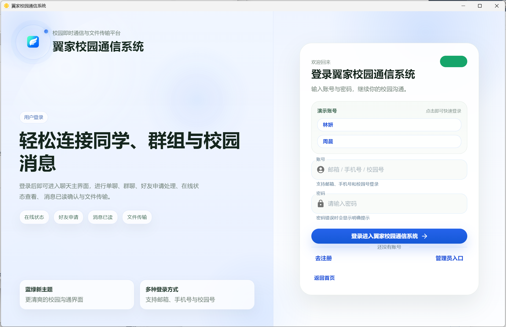
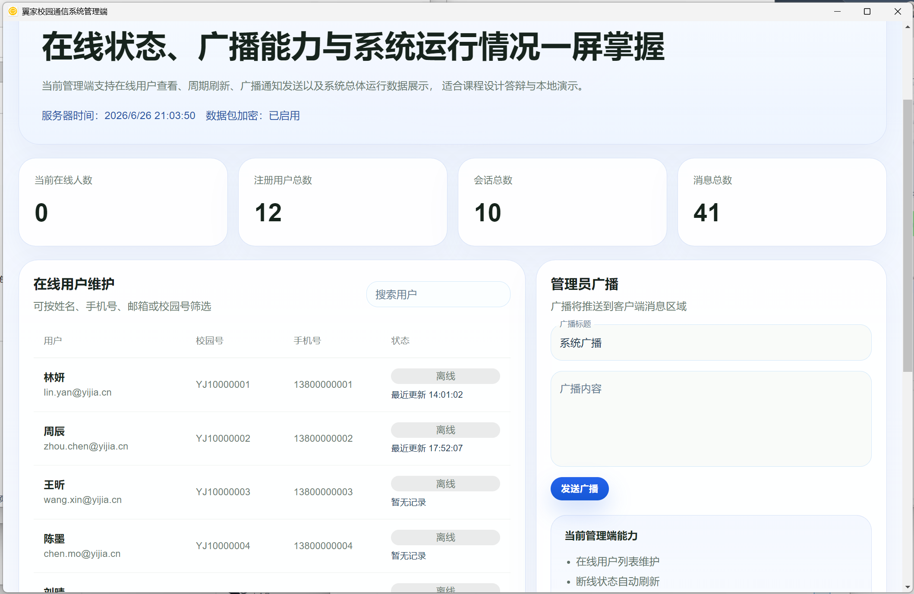

# 翼家校园通信系统

<p align="center">
  
  
</p>

一个基于 **Spring Boot + React + Electron** 全栈架构的校园即时通信桌面应用，支持用户注册登录、好友管理、单聊群聊、文件传输、在线状态展示与管理员广播功能。

## 项目简介

翼家校园通信系统是一个面向校园场景的即时通信平台，采用前后端分离架构，最终以 Windows 桌面应用形式交付。用户可通过校园号、手机号或邮箱注册登录，搜索添加好友，进行一对一或群组聊天，发送文件，并实时查看联系人是否在线。管理员可通过独立入口登录控制台，查看系统概况并向所有用户广播通知。

## 技术栈与语言版本

| 层级 | 技术 | 版本 | 说明 |
|------|------|------|------|
| 后端 | Java (OpenJDK) | **17 LTS** | 编译器 javac 17+ |
| 后端框架 | Spring Boot | **3.2.3** | REST API + WebSocket |
| 后端构建 | Apache Maven | **3.9+** | 使用 Maven Wrapper（mvnw） |
| 数据库 | H2 / PostgreSQL | H2 2.x | 本地开发默认 H2 文件数据库 |
| 前端 | TypeScript | **4.9** | |
| 前端框架 | React | **18.2** | Create React App 5.0.1 |
| 前端 UI | Material UI (MUI) | **5.15** | |
| 状态管理 | Redux | 5.x | Redux Thunk 异步处理 |
| 实时通信 | WebSocket (STOMP) | — | SockJS + STOMP.js |
| 身份认证 | JWT (jjwt 0.12.5) | — | HMAC-SHA256 |
| 桌面壳 | Electron | **28.3.3** | 桌面封装 |
| 桌面构建 | electron-builder | **24.13.3** | 打包为 exe |
| 启动器 | C# (.NET Framework 4.x) | **10.0** | 编译器 csc.exe |
| 打包脚本 | PowerShell | **5.1+** | build-yijia-exe.ps1 |

## 功能列表

- 用户注册、登录、退出（支持校园号/手机号/邮箱登录）
- 用户搜索（按校园号、手机号、姓名模糊搜索）
- 好友申请、审批、拒绝与备注管理
- 联系人列表与在线状态展示
- 单聊与群聊（创建群聊、加人、踢人、重命名群名）
- 实时消息推送（WebSocket STOMP 协议）
- 消息已读状态追踪（逐人精确已读标记）
- 文件上传、发送与下载（支持 20MB 以内的文件）
- 聊天历史记录查询（按时间升序排列）
- 管理员独立入口，系统概况查看与广播通知
- 管理员广播加密传输（XOR + Base64）
- Windows 桌面端打包（便携版 / 安装包）

## 目录结构

```
翼家校园通信系统/
│
├── backend/                          # Spring Boot 后端 (Java 17, Maven)
│   ├── pom.xml                       # Maven 项目配置与依赖声明
│   ├── mvnw / mvnw.cmd              # Maven Wrapper（无需本地安装 Maven）
│   ├── .gitignore
│   └── src/
│       ├── main/java/com/nicolas/chatapp/
│       │   ├── ChatappApplication.java          # 应用入口
│       │   ├── model/                # JPA 实体 (User, Chat, Message 等 5 个)
│       │   ├── repository/           # 数据访问层 (5 个接口)
│       │   ├── service/              # 服务接口 (5 个) + 实现 (7 个)
│       │   ├── controller/           # REST 控制器 (7 个)
│       │   ├── config/               # 配置类 (Security, JWT, WebSocket 等 13 个)
│       │   ├── dto/                  # 请求/响应 DTO (16 个)
│       │   └── exception/            # 全局异常处理 (5 个)
│       ├── main/resources/
│       │   ├── application.properties
│       │   └── static/               # 前端构建产物（已预置，开箱即用）
│       └── test/java/                # 9 个测试用例
│
├── frontend/                         # React 前端 (TypeScript)
│   ├── package.json                  # npm 依赖与脚本
│   ├── tsconfig.json                 # TypeScript 编译配置
│   ├── .gitignore
│   ├── public/                       # 静态资源入口
│   ├── scripts/
│   │   └── copy-build-to-backend.cjs # 前端构建后自动复制到后端 static/
│   └── src/
│       ├── index.tsx                 # 应用入口
│       ├── App.tsx                   # 路由配置
│       ├── theme.ts                  # MUI 主题配置
│       ├── index.css                 # 全局样式
│       ├── config/                   # API 配置
│       ├── redux/                    # Redux 状态管理 (auth/chat/message)
│       └── components/               # UI 组件 (13 个页面/组件)
│
├── desktop-shell/                    # Electron 桌面壳
│   ├── main.js                       # Electron 主进程
│   └── package.json                  # 打包配置 (electron-builder)
│
├── scripts/                          # 构建脚本
│   └── build-yijia-exe.ps1           # 全自动打包脚本
│
├── tools/                            # C# 工具源码
│   ├── launcher/
│   │   ├── YijiaLauncher.cs
│   │   └── YijiaDesktopBootstrap.cs
│   └── installer/
│       └── YijiaSetupInstaller.cs
│
├── README.md                         # 本文件
└── .gitignore                        # Git 忽略规则
```

> **关于 `backend/src/main/resources/static/`：** 该目录下存放了前端构建后的产物（`.js`、`.css`、`.png` 等），已预置在仓库中。这样做的目的是：其他人 `git clone` 后只需 `./mvnw spring-boot:run` 就能直接看到页面，无需额外构建前端。如果需要修改前端代码，请到 `frontend/` 目录开发，修改后执行 `npm run build:backend` 即可更新 `static/` 中的文件。

## 环境要求

| 依赖 | 最低版本 | 推荐版本 |
|------|---------|---------|
| JDK | 17 | [Temurin JDK 21 LTS](https://adoptium.net/) |
| Node.js | 18.x | 18.x LTS |
| npm | 9+ | 会随 Node.js 自动安装 |
| Maven | 3.9+ | 使用自带的 mvnw，无需手动安装 |
| 操作系统 | Windows 10/11 | 开发/运行均可 |
| 可选：Python | 3.8+ | 仅桌面打包生成图标时需要 |
| 可选：PostgreSQL | 15+ | 如需切换数据库 |

## 本地启动

### 方式一：仅启动后端（前端已预置，开箱即用）

```bash
cd backend
./mvnw spring-boot:run
```

浏览器访问 `http://127.0.0.1:8080` 即可进入登录页面。

默认账号：
| 角色 | 账号 | 密码 |
|------|------|------|
| 管理员 | admin@yijia-campus.local | YijiaCampusAdmin@123 |
| 演示用户 | lin.yan@yijia.cn | 123456 |

首次启动自动创建 H2 文件数据库并写入演示数据。

### 方式二：前后端分离开发

**终端 1 — 启动后端：**
```bash
cd backend
./mvnw spring-boot:run
```

**终端 2 — 启动前端开发服务器：**

```bash
cd frontend
npm install
npm start
```

前端开发服务器在 `http://127.0.0.1:3000` 启动，API 请求自动代理到后端 8080 端口。修改前端代码时热更新。

### 方式三：构建桌面程序

```bash
cd desktop-shell
npm install
cd ..
.\scripts\build-yijia-exe.ps1
```

需要提前安装 Java 17+、Node.js 18.x、Python 3.x（生成图标用），并下载 Electron 28.3.3 缓存包。

## 测试

```bash
# 后端测试（9 个测试用例）
cd backend
./mvnw test

# 前端测试
cd frontend
npm test
```

## 部署到服务器

```bash
cd backend
./mvnw package -DskipTests
# 上传 target/chatapp-0.0.1-SNAPSHOT.jar 到服务器
java -jar chatapp-0.0.1-SNAPSHOT.jar --server.port=80
```

**注意：** 如果桌面端需要连接到远程服务器（而非本地后端），请在桌面端电脑上创建配置文件 `%APPDATA%\yijia-campus-desktop-shell\config.json`，内容如下：

```
{"serverBaseUrl": "http://你的服务器IP"}
```

这样桌面版启动后会自动连接远程服务器，多台电脑即可互相通信。

## 协作开发规范

### Git 分支策略

```
main          — 稳定版本，只合并经过 review 的代码
dev           — 日常开发分支
feature/xxx   — 新功能开发（从 dev 创建，完成后合并回 dev）
fix/xxx       — Bug 修复（从 dev 创建）
```

### 提交信息格式

```
<type>: <简短描述>

<详细说明（可选）>
```

| type | 说明 |
|------|------|
| feat | 新增功能 |
| fix | 修复 Bug |
| refactor | 重构代码 |
| style | 代码格式调整 |
| docs | 文档更新 |
| test | 测试相关 |
| chore | 构建/工具链变更 |

示例：
```
feat: 新增消息撤回功能
fix: 修复文件上传进度条不更新的问题
docs: 更新部署说明
```

### 代码规范

- Java：遵循阿里巴巴 Java 开发手册基本规范，类名大驼峰、方法名小驼峰
- TypeScript/React：使用 ESLint + Prettier 保持一致风格
- 每个 Controller 类保持 RESTful 风格，路径统一使用小写复数名词
- Service 层接口与实现分离，通过 `@RequiredArgsConstructor` 构造器注入

### 提交流程

1. 从 `dev` 创建新分支
2. 开发完成后本地测试（后端 `mvn test`，前端 `npm test`）
3. 提交并推送到远程仓库
4. 创建 Pull Request 到 `dev` 分支
5. Code Review 通过后合并

## 常见问题

**Q: 启动时提示端口被占用？**
```bash
# 修改后端端口
./mvnw spring-boot:run -Dspring-boot.run.arguments=--server.port=8081
```

**Q: 数据库文件在哪？**
默认路径：`${user.home}/.yijia/data/chatappdb`

**Q: 上传的文件存哪了？**
默认路径：`${user.home}/yijia-uploads/`

**Q: 如何切换为 PostgreSQL？**

```bash
./mvnw spring-boot:run -DYIJIA_DB_URL=jdbc:postgresql://localhost:5432/yijia \
  -DYIJIA_DB_DRIVER=org.postgresql.Driver \
  -DYIJIA_DB_USERNAME=postgres \
  -DYIJIA_DB_PASSWORD=your_password
```
